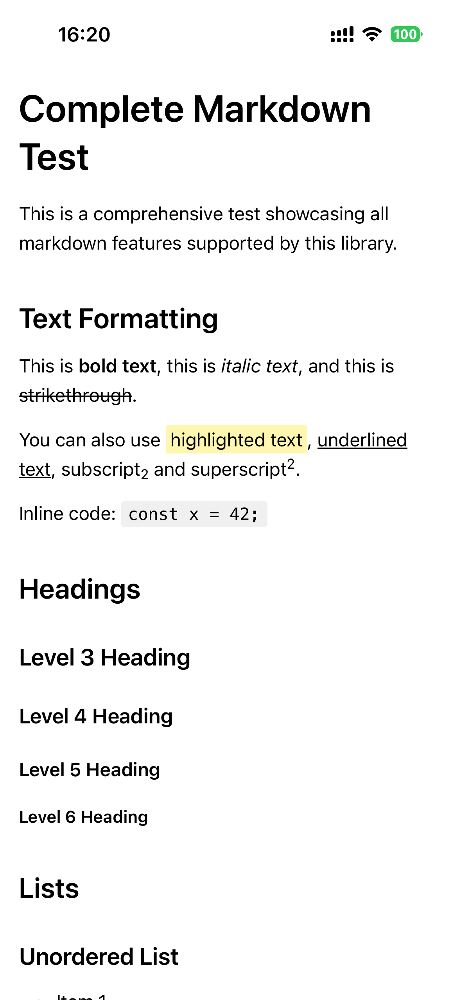
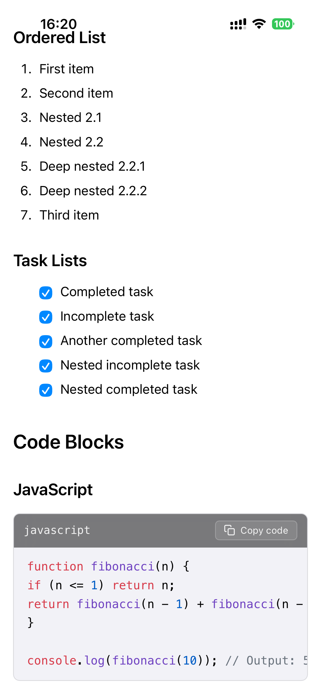
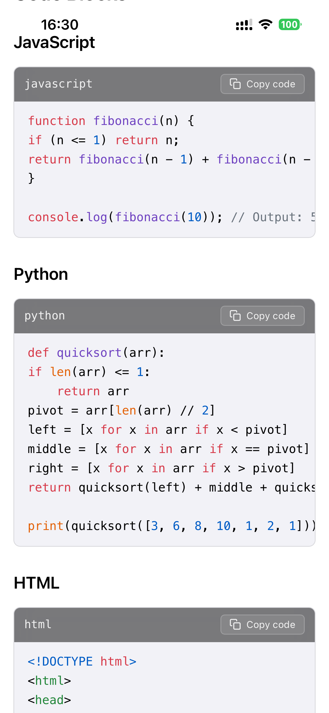
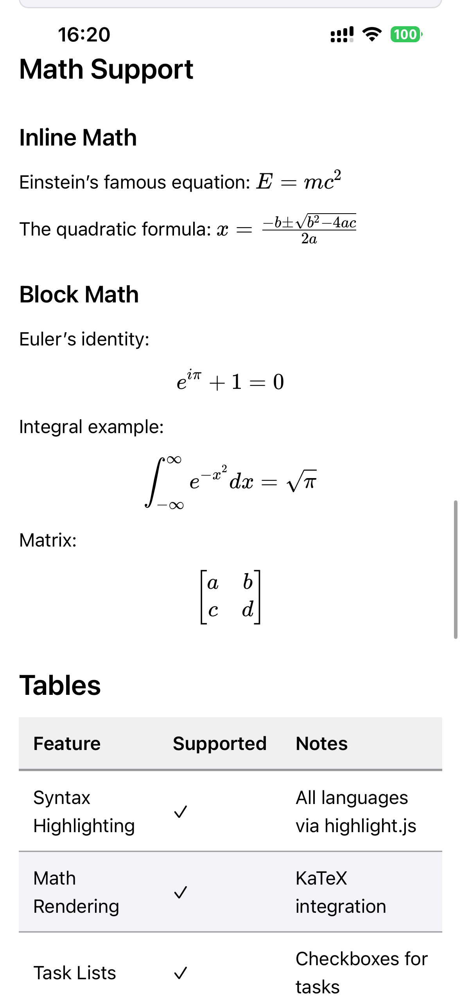
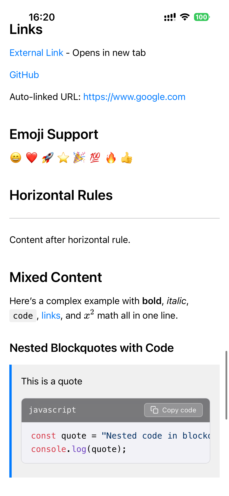
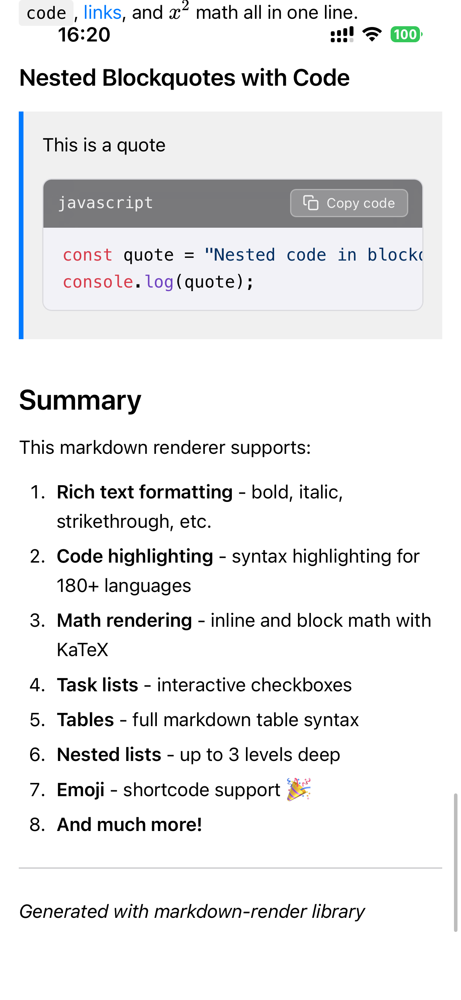

# SwiftMarkdownKit

The iOS Markdown renderer built for streaming AI output. Render polished Markdown, code, math and full conversations with one native Swift API.

**Official website:** [https://macdeer.com/swift-markdown-kit](https://macdeer.com/swift-markdown-kit) · **More products:** [https://macdeer.com](https://macdeer.com)

[简体中文](README.zh-CN.md)

## Showcase

A screen recording on an iPhone: the reasoning arrives first and folds itself
away, the answer streams in, and the formulas are typeset while they are still
being written.

<video src="https://macdeer.com/media/swift-markdown-kit/v0.0.10/demo.mp4" controls muted playsinline width="320"></video>

<table>
  <tr>
    <td width="33%"></td>
    <td width="33%"></td>
    <td width="33%"></td>
  </tr>
  <tr>
    <td align="center">Rich text</td>
    <td align="center">Lists & code</td>
    <td align="center">Syntax highlighting</td>
  </tr>
  <tr>
    <td></td>
    <td></td>
    <td></td>
  </tr>
  <tr>
    <td align="center">Math & tables</td>
    <td align="center">Links & mixed content</td>
    <td align="center">Nested content</td>
  </tr>
</table>

## Features

- Complete Markdown: headings, rich text, nested lists, task lists, blockquotes, tables, links, emoji and optional raw HTML.
- Code blocks with syntax highlighting for 180+ languages and built-in copy actions.
- KaTeX inline and display math, including `\ce{}` chemistry notation.
- Nothing turns red on half-written Markdown. A `$` beside a price, a bracketed citation, a formula whose closing brace has not arrived — an expression that cannot be parsed falls back to the characters that were written.
- Reasoning folds: a model's chain of thought — inline `<think>` … `</think>` or a separate `reasoning_content` field — streams into a collapsible panel above the answer and folds itself away once the answer starts.
- Long answers stay smooth all the way to the end, and one renderer draws a whole conversation rather than one per message.
- Document and conversation renderers for SwiftUI and UIKit.
- Light/dark themes, Dynamic Type, custom theme tokens and content insets.
- English and Simplified Chinese out of the box: the SDK's own words follow the reader's device, or the language your app is already showing.
- Taps handled for you: links open in an in-app browser, images open full screen, code and messages copy — with a one-line escape hatch when the app wants one of them back.
- Link, render, height, error and custom-syntax events.
- Renders on the device. No rendering service, no network call, nothing leaves the app.

## Installation & Usage

Requires iOS 17 or later. Mac apps are supported through Mac Catalyst — the same implementation, so a formula, a table or a streamed answer renders identically on both.

Build a Mac against the **My Mac (Mac Catalyst)** destination, not **My Mac**. The latter builds for native macOS, where there is no UIKit and no slice to link, and it fails with `No such module 'UIKit'`. A native AppKit target is not supported.

### Swift Package Manager

In Xcode, choose **File → Add Package Dependencies** and enter:

`https://github.com/cellgit/swift-markdown-kit.git`

Or add it to `Package.swift`:

```swift
dependencies: [
    .package(url: "https://github.com/cellgit/swift-markdown-kit.git", from: "0.0.10")
]
```

Add the `SwiftMarkdownKit` product to your app target.

### XCFramework

Download `SwiftMarkdownKit-0.0.10.xcframework.zip` from the [v0.0.10 release](https://github.com/cellgit/swift-markdown-kit/releases/tag/v0.0.10). Drag `SwiftMarkdownKit.xcframework` into Xcode, add it to the app target, and select **Embed & Sign**.

### Render Markdown with SwiftUI

```swift
import SwiftUI
import SwiftMarkdownKit

struct ArticleView: View {
    let markdown: String

    var body: some View {
        MarkdownRenderView(markdown: markdown)
    }
}
```

### Stream an AI response

```swift
let controller = MarkdownRenderViewController()
controller.startStreaming()

for try await chunk in response {
    controller.appendChunk(chunk)
}

controller.finishStreaming()
```

When a SwiftUI-bound Markdown string grows by appending text, `MarkdownRenderView` automatically uses the same incremental path.

### Render a conversation

```swift
struct ConversationView: View {
    @State private var messages: [MarkdownChatMessage] = []

    var body: some View {
        MarkdownChatRenderView(messages: messages)
    }
}
```

### Taps

Nothing to wire up. A renderer handed only markdown already opens links in an
in-app `SFSafariViewController`, opens images in a full-screen viewer, and
copies code — because ``interaction`` defaults to `.automatic`.

Taking one back is a single assignment, and it costs you nothing else:

```swift
var options = MarkdownChatRenderOptions()
options.interaction.images = .handledByHost   // links stay automatic
```

```swift
case .action(let event):
    if case .imageTapped(let url) = event.action { presentMyOwnViewer(url) }
```

| policy | what happens | what you hear |
|---|---|---|
| `.automatic` (default) | the SDK opens it in-app | `didOpenLink` / `didPresentImage` — notification only |
| `.handledByHost` | nothing | `linkTapped` / `imageTapped` — act on it or nothing happens |
| `.disabled` | nothing, and the element stops looking tappable | nothing |

`options.interaction = .manual` sets both to `.handledByHost` at once.

Whatever the policy, a link whose scheme is not in `allowedLinkSchemes`
(`http`, `https`, `mailto` by default) is never opened *and never handed over* —
it arrives as `linkBlocked`. Rendered text is model output, and a `javascript:`
or deep-link URL is not something to forward unexamined. Add your own scheme to
allow it:

```swift
options.interaction.allowedLinkSchemes.insert("myapp")
```

Copying, the reasoning fold and task boxes are not policies: the SDK always
performs them, because they need nothing from the app. Only their presence is
configurable (`messageActions`, `interaction.allowsCodeCopy`).

Retry and edit are the reverse — the SDK cannot re-run a request or write into
your composer, so those buttons appear only when you list them, and listing them
is the promise that you handle
`MarkdownChatRenderEvent.messageAction`:

```swift
options.messageActions.assistantActions = [.copy, .retry]
```

### Show a model's reasoning

Reasoning written inline needs nothing: pass it through with the rest of the
content and the renderer separates it out.

```swift
controller.appendChunk("<think>weighing the options</think>The answer is 42.", to: id)
```

When the provider streams reasoning in its own field (`reasoning_content` on
DeepSeek, Qwen and GLM, `reasoning` on OpenRouter), send it to the other channel:

```swift
for try await event in response {
    switch event {
    case .reasoning(let text): controller.appendReasoningChunk(text, to: id)
    case .content(let text):   controller.appendChunk(text, to: id)
    }
}
```

Either way the fold opens while the model thinks and collapses the moment the
answer starts. A reader who opens or closes it themselves is never overruled.

```swift
var options = MarkdownChatRenderOptions()
options.reasoning = MarkdownChatReasoningConfiguration(
    thinkingLabel: "Thinking…",
    completedLabel: "Thought process",
    durationLabelFormat: "Thought for {seconds}s"
)
```

`MarkdownChatMessage.reasoning` carries the same text when a whole conversation
is handed over at once, and `MarkdownRenderOptions.MarkdownConfig.reasoning`
configures the fold for the single-document renderer.

### Tune the streaming path

How long arriving chunks are gathered before being handed to the renderer.
This does not change when text appears — the reveal is paced per frame either
way. Set it to 0 to hand every chunk over as it arrives.

```swift
var options = MarkdownChatRenderOptions()
options.chunkCoalescingInterval = 1.0 / 30.0   // default
```

### Customize the renderer

```swift
let options = MarkdownRenderOptions(
    colorScheme: .auto,
    theme: .github,
    contentPadding: UIEdgeInsets(top: 20, left: 16, bottom: 20, right: 16),
    baseFontSize: 16
)

MarkdownRenderView(markdown: markdown, options: options)
```

### Localization

The words the SDK puts on screen itself — a code block's copy button, the reasoning fold's header, the accessibility labels on message actions — ship in English and Simplified Chinese. There is nothing to turn on. Leave the string options unset and each reader gets the language their device is set to, falling back to English:

```swift
let options = MarkdownRenderOptions()
```

Pin the language when your app has its own language picker and the SDK should follow that rather than iOS:

```swift
MarkdownRenderLocalization.language = .simplifiedChinese
```

Set it during startup, before you build the options you hand to a renderer. The strings are read when an options value is *constructed*, so a later change does not reach back into options that already exist.

Any string you pass yourself still wins, so an app that has already translated these words keeps its own wording:

```swift
MarkdownRenderOptions(copyText: "拷贝")
```

The SDK follows the **device's** language, not the host app's. iOS normally holds every framework in a process to the app's own declared localizations, so an app that hardcodes its Chinese strings — rather than shipping a `zh-Hans.lproj` — would otherwise force this SDK to English on a Chinese device. Resolving against the device instead means the SDK is translated whether or not the app ever declared a localization. Pin ``language`` if you want it held to the app's language instead.

Rendered Markdown is the author's text and is never translated.

For production, add your issued `.smklicense` file to **Copy Bundle Resources**. Evaluation remains fully functional without one and displays a small unlicensed badge.
